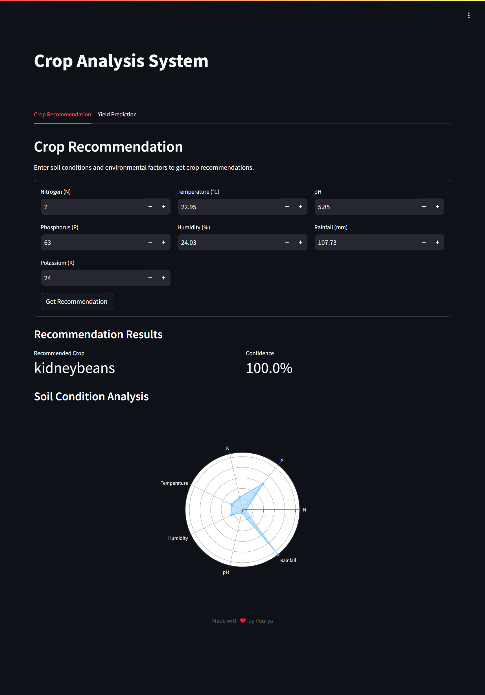
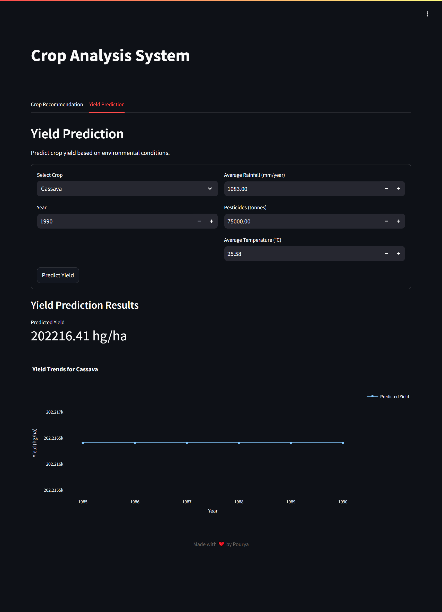

# 🌾 Crop Recommendation and Yield Prediction System

An advanced machine learning system that provides crop recommendations based on soil conditions and predicts crop yields using environmental factors. Built with TensorFlow and Streamlit for an interactive user experience.

## 📋 Table of Contents
- [Overview](#overview)
- [Features](#features)
- [Datasets](#datasets)
- [Technical Details](#technical-details)
- [Installation](#installation)
- [Deployment Options](#deployment-options)
- [File Structure](#file-structure)
- [Usage](#usage)
- [Contributing](#contributing)
- [Acknowledgments](#acknowledgments)
- [License](#license)

[Previous sections remain the same until File Structure]

## 📁 File Structure

| File/Directory | Description |
|---------------|-------------|
| 📦 crop-recommendation-and-yield-prediction | Root directory of the project |
| ┣ 📂 app/ | Main application directory containing all deployment files |
| ┃ ┣ 📂 models/ | Directory containing trained models and encoders |
| ┃ ┃ ┣ 📜 recommendation.keras | Trained neural network model for crop recommendation |
| ┃ ┃ ┣ 📜 recommendation_encoder.joblib | Label encoder for crop recommendation |
| ┃ ┃ ┣ 📜 yield_encoder.joblib | Label encoder for crop types in yield prediction |
| ┃ ┃ ┗ 📜 yield_model.joblib | Trained XGBoost model for yield prediction |
| ┃ ┣ 📜 app.py | Main Streamlit application script |
| ┃ ┣ 📜 app.yaml | Google Cloud Platform configuration file |
| ┃ ┣ 📜 Dockerfile | Docker configuration for containerization |
| ┃ ┣ 📜 Procfile | Heroku deployment configuration |
| ┃ ┣ 📜 requirements.txt | Python package dependencies |
| ┃ ┣ 📜 setup.py | Package setup configuration |
| ┃ ┗ 📜 setup.sh | Shell script for environment setup |
| ┣ 📜 .gitattributes | Git attributes configuration |
| ┣ 📜 .gitignore | Git ignore patterns |
| ┣ 📜 Crop_Recommendation_and_Yield_Prediction.ipynb | Jupyter notebook containing model development |
| ┣ 📜 LICENSE | MIT license file |
| ┣ 📜 README.md | Project documentation (this file) |
| ┣ 📜 screencapture-recommendation.png | Screenshot of recommendation interface |
| ┗ 📜 screencapture-yield.png | Screenshot of yield prediction interface |

[Previous Usage and Contributing sections remain the same]

## 🙏 Acknowledgments

This project is inspired by and builds upon several excellent works and resources:

- The Crop Recommendation Dataset by Siddharth on Kaggle
- The Crop Yield Prediction Dataset by Rishit Patel
- The TensorFlow team for their excellent deep learning framework
- The Streamlit team for their amazing web application framework
- The XGBoost team for their efficient implementation
- The scikit-learn community for preprocessing tools
- Various agricultural research papers and datasets that have contributed to the field
- The open-source community for their invaluable tools and libraries
- All researchers and data scientists working on agricultural technology
- Special thanks to agricultural experts who provided domain knowledge

This project would not have been possible without the foundational work and datasets provided by these individuals and organizations. Their contributions to the field of agricultural technology and machine learning have been instrumental in making this project possible.

## 📄 License

This project is licensed under the MIT License - see the [LICENSE](LICENSE) file for details.

Made with ❤️ by [Pouryare](https://github.com/pouryare)

